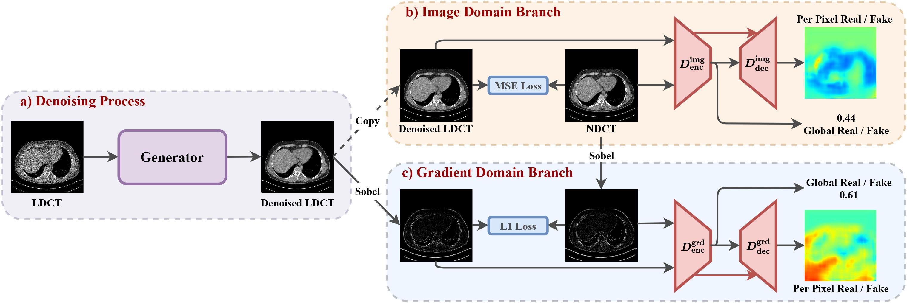
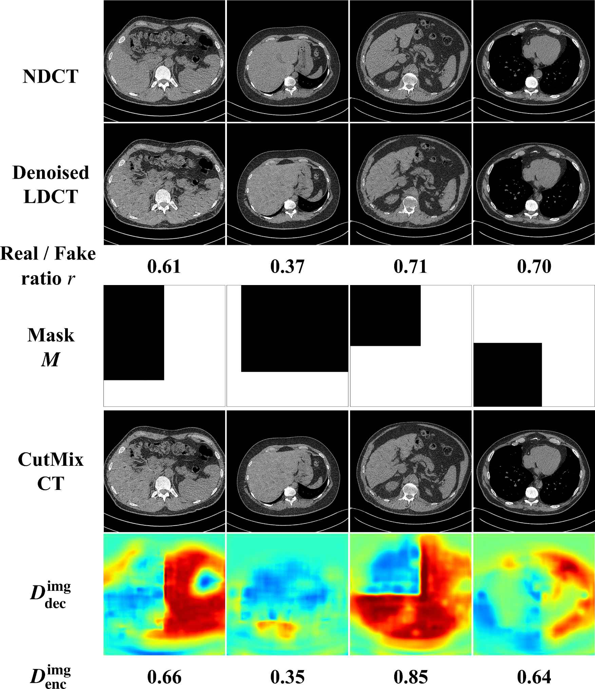
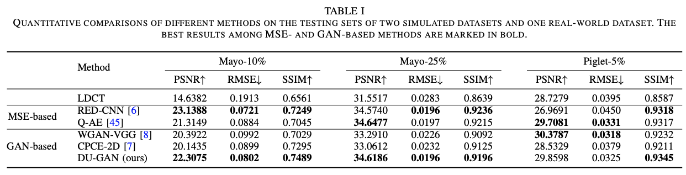

### DU-GAN
This repository contains the PyTorch implementation of the paper: **DU-GAN: Generative Adversarial Networks with Dual-Domain U-Net Based Discriminators for Low-Dose CT Denoising**

> DU-GAN: Generative Adversarial Networks with Dual-Domain U-Net Based Discriminators for Low-Dose CT Denoising<br>
> https://arxiv.org/abs/2108.10772 <br>
> Abstract: LDCT has drawn major attention in the medical imaging field due to the potential health risks of CT-associated X-ray radiation to patients. Reducing the radiation dose, however, decreases the quality of the reconstructed images, which consequently compromises the diagnostic performance. Various deep learning techniques have been introduced to improve the image quality of LDCT images through denoising. GANs-based denoising methods usually leverage an additional classification network, i.e. discriminator, to learn the most discriminate difference between the denoised and normal-dose images and, hence, regularize the denoising model accordingly; it often focuses either on the global structure or local details. To better regularize the LDCT denoising model, this paper proposes a novel method, termed DU-GAN, which leverages U-Net based discriminators in the GANs framework to learn both global and local difference between the denoised and normal-dose images in both image and gradient domains. The merit of such a U-Net based discriminator is that it can not only provide the per-pixel feedback to the denoising network through the outputs of the U-Net but also focus on the global structure in a semantic level through the middle layer of the U-Net. In addition to the adversarial training in the image domain, we also apply another U-Net based discriminator in the image gradient domain to alleviate the artifacts caused by photon starvation and enhance the edge of the denoised CT images. Furthermore, the CutMix technique enables the per-pixel outputs of the U-Net based discriminator to provide radiologists with a confidence map to visualize the uncertainty of the denoised results, facilitating the LDCT-based screening and diagnosis. Extensive experiments on the simulated and real-world datasets demonstrate superior performance over recently published methods both qualitatively and quantitatively.

### Illustration






### DATASETS 
In the paper, we have used three datasets with different dose, including the mayo dataset from chest and abdomen, the piglet dataset from [sharpness-aware low-dose CT denoising using conditional generative adversarial network]. To our knowledge, the chest is the most challenge dataset since it has the lowest dose.

Here, we provide the preprocessing code that crop the image patch from the source data, and the processed training and testing data of chest.

The processed datasets can be downloaded from Baidu Disk: https://pan.baidu.com/s/1SEHkDoaBM-5K6K5iwkqJOA, password `ujn8`, and Google Drive https://drive.google.com/drive/folders/13u7-9arHAqTNk77mGvvIXYtFD39de3kt?usp=sharing. Please download and unzip them into the dataset folder.

For the rest datasets, we provide the training and testing ids, please see `dataset/cmayo/**_id.csv`. To generate the datasets with numpy format, change the parameters, and run the following code:

```shell
python dataset/gen_data.py
```

#### Training
Here we provide both RED-CNN and our DU-GAN implementation. Run the following code:
```shell
sh train_redcnn.sh
```
and
```shell
sh train_dugan.sh
```
The default parameters can be run on single 2080Ti GPU.

### Requirements
```
torch==1.9.0
tqdm
torchvision
numpy
kornia
pandas
pydicom
```

### Citation

If you found this code or our work useful please cite us:

```
@misc{huang2021dugan,
      title={DU-GAN: Generative Adversarial Networks with Dual-Domain U-Net Based Discriminators for Low-Dose CT Denoising}, 
      author={Zhizhong Huang and Junping Zhang and Yi Zhang and Hongming Shan},
      year={2021},
      eprint={2108.10772},
      archivePrefix={arXiv},
      primaryClass={eess.IV}
}
```